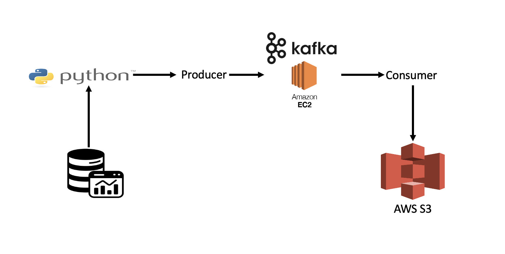

# Real-Time Stock Market Data Processing Project with Kafka

## Introduction

In this project, you'll carry out a comprehensive Data Engineering Project focused on Real-Time Stock Market Data utilizing Kafka.

We'll employ various technologies including Python, Amazon Web Services (AWS) S3, Amazon Web Services (AWS) EC2, Apache Kafka, and SQL.

## Architecture

